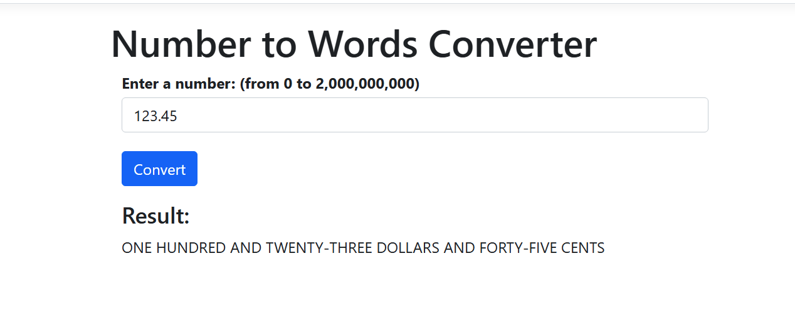

# Number to Words Converter

This application converts numerical input into words and displays the result on a web page.

## Prerequisites

- .NET 8.0 SDK
- Visual Studio 2022

## Building the Solution

Build the application from the command line:

```
dotnet build
```

## Running the Application

Run the application from the command line:

```
dotnet run --project WordsWebApplication
```

4. Open a web browser and navigate to `http://localhost:5289`.

## Interacting with the Application

1. Enter a number (whole or decimal) in the input field.
2. Click the "Convert" button or press Enter.
3. The converted result will appear below the input field.

Screenshot
<div style="border: 1px solid #444; padding: 10px;">
  
</div>

## Running Tests

To list the names of all the tests 
```
dotnet test UnitTests/UnitTests.csproj --list-tests
```


To run tests from the command line:

```
dotnet test UnitTests/UnitTests.csproj
```

## Additional Documentation

- See `Approach.md` for information on the chosen approach and alternatives considered.
- See `TestPlan.md` for a comprehensive test plan.